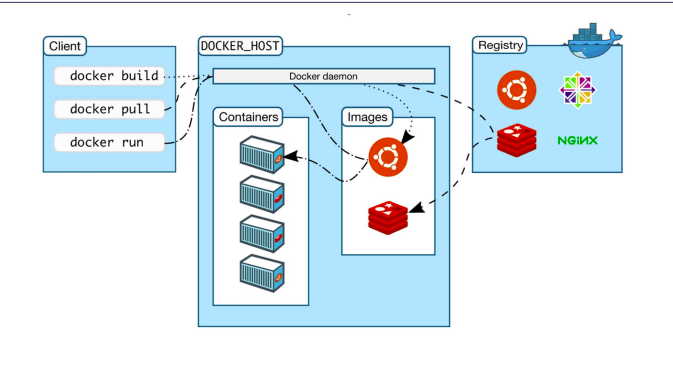
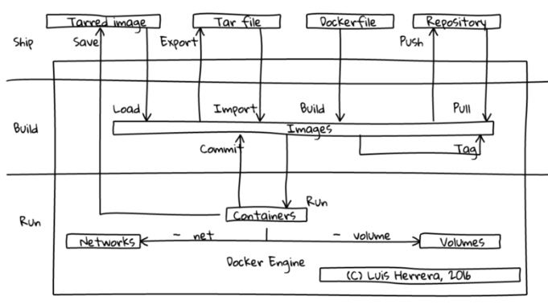

# Các thành phần của docker và cách chúng hoạt hoạt động

## Kiến trúc của Docker
Docker sử dụng kiến trúc client-server. Docker client sẽ liên lạc với các Docker daemon, các Docker daemon sẽ thực hiện các tác vụ build, run và distribuing các Docker container. Cả Docker client và Docker daemon có thể chạy trên cùng 1 máy, hoặc có thể kết nối theo kiểu Docker client điều khiển các docker daemon như hình trên. Docker client và daemon giao tiếp với nhau thông qua socket hoặc RESTful API

Docker daemon chạy trên các máy host. Người dùng sẽ không tương tác trực tiếp với các daemon, mà thông qua Docker Client.
Về cơ bản Docker chi làm 3 phần.
- Docker Client

Docker Client là nơi tiếp nhận các câu lệnh của người dùng sau đó gửi các câu lệnh đến Docker server tại đây Docker Server sẽ chạy câu lệnh và kết quả là tạo ra 1 container chạy service/ câu lệnh người dùng.
- Docker Server 

Là nơi tiếp nhận và xữ lý các câu lệnh từ Docker Client và tạo ra container
- Docker registry

Là kho lưu trữ các ứng dụng mà  Docker server có thể tải về và sử dụng.

 Ví dụ : 
 Hiện tại Dev A có một chương trình Nginx-Apache và đóng gói qua bên Dev B.
 Tại Docker server bên Dev B sau khi nhận câu lệnh tạo một chương trình nginx này. Đầu tiên Docker Server sẽ kiểm tra xem trên Docker có Image về chương trình đó chưa nếu có rồi thì cứ việc tạo từ image đó nếu chưa có thì Docker Server có thể lên Docker Redistry để tải Image về và chạy chương trình từ Image đó.

## Docker Engine -  tên gọi chính xác của Docker

Docker Engine là công cụ Client - Server hỗ trợ công nghệ container để xử lý các nhiệm vụ và quy trình công việc liên quan đến việc xây dựng các ứng dụng dựa trên vùng chứa (container).

Engine tạo ra một quy trình daemon phía máy chủ lưu trữ images, containers, networks và storage volumes. 

Daemon cũng cung cấp giao diện dòng lệnh phía máy khách (CLI) cho phép người dùng tương tác với daemon thông qua giao diện lập trình ứng dụng Docker

## Docker Images
Là thành phần để đóng gói ứng dụng và các thành phần mà ứng dụng phụ thuộc để chạy. Và image được lưu trữ ở trên local hoặc trên một Registry (là nơi lưu trữ và cung cấp kho chứa các image)

## Docker Containers

Là một instance của image, và nó hoạt động như một thư mục, chứa tất cả những thứ cần thiết để chạy một ứng dụng

## Docker Volume
Volume trong Docker được dùng để chia sẻ dữ liệu cho container
## [Docker Network](DockerNetwork.md)
Cung cấp một private network chỉ tồn tại giữa container và host

## Distribution tools
Là các công cụ phân tán để lưu trữ và quản lý các Docker Images như: Docker Registry, Docker Trusted Registry, Docker Hub.
## Orchestration tools
- Docker Machine: Machine tạo Docker Engine trên laptop của bạn hoặc trên bất cứ dịch vụ cloud phổ biến nào như AWS, Azure, Google Cloud, Softlayer hoặc trên hệ thống data center như VMware, OpenStack. Docker Machine sẽ tạo các máy ảo và cài Docker Engine lên chúng và cuối cùng nó sẽ cấu hình Docker Client để giao tiếp với Docker Engine một cách bảo mật
- Docker Compose: là công cụ giúp định nghĩa và khởi chạy multi-container Docker applications
- Docker Swarm: là một công cụ giúp chúng ta tạo ra một clustering Docker. Nó giúp chúng ta gom nhiều Docker Engine lại với nhau và ta có thể "nhìn" nó như duy nhất một virtual Docker Engine

## Một số thành phần khác
- Dockerfile: như một script dùng để build các image trong container. Dockerfile bao gồm các câu lệnh liên tiếp nhau được thực hiện tự động trên một image gốc để tạo ra một image mới. Dockerfile giúp đơn giản hóa tiến trình từ lúc bắt đầu đến khi kết thúc
- Docker Toolbox: Bởi vì Docker Engine dùng một số feature của kernel Linux nên ta sẽ không thể chạy Docker Engine natively trên Windows hoặc BSD được. Ở các phiên bản trước đây thì ta sẽ cần một máy ảo cài một phiên bản Linux nào đó và sau đó cài Docker Engine lên máy ảo đó